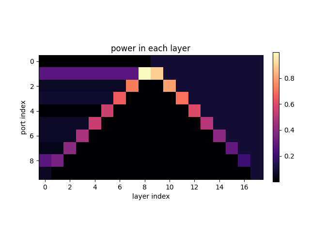

# DLA phase control

This code is used to simulate an MZI mesh used for phase and amplitude control of a dielectric laser accelerator.

For more information, see [this paper](https://arxiv.org/abs/1709.04441).

## Code Structure:
The code is organized as follows

    DLA_Control/
        alorithms.py
        mesh.py
        plots.py
        util.py
    examples/
        mesh_demo.py
        optimize_demo.py
    tests/
        test_coupling.py
        test_mesh.py
        test_MZI.py

### Package
The main package is contained in `DLA_Control`.

#### Meshes
In `mesh.py`you will find `Mesh` objects that define the MZI mesh and contain all of the relevant transfer matrices.
Currently, `Triangular` and `Clements` meshes are supported.  Printing these Mesh objects prints an ASCII representation of the mesh.

To make a Clements mesh with N ports and M layers and random phase shifter initialization:
    
    mesh = Mesh(N, mesh_type='clements', initialization='random', M=M)
    print(mesh)

To make a Triangular mesh with N ports and phase shifter initialized with all zeros (transmission):

    mesh = Mesh(N, mesh_type='triangular', initialization='zeros')
    print(mesh)

To couple light into the mesh and view the power through the device
    
    input_values = np.random.random((N,))
    mesh.input_couple(input_values)
    im = plot_powers(mesh)
    plt.show()
    
For an example see `examples/mesh_demo.py` or the methods of `Mesh` as defined in `DLA_Control/mesh.py`

#### Optimizers

For each `Clements` and `Triangular` meshes, there is an optimizer class that operates on the mesh, changing its MZI phase shifter settings to optimize for a given input-output relation.

These can be initialized with the input and target (complex-valued) mode amplitudes as

    TO = TriangleOptimizer(mesh, input_values=input_values, output_target=output_target)
    CO = ClementsOptimizer(mesh, input_values=input_values, output_target=output_target)

Then, one can call the `optimize()` method on these optimizers with an algorithm to do the tuning.  For example:

    CO.optimize(algorithm='smart', verbose=False)
   
Triangular Optimizers contain `up_down` and `spread` algorithms.
Clements Optimizers contain `smart` and `basic` algorithms.

Read more about these in `DLA_Control/algorithms.py` or see `examples/optmize_demo.py` for more examples.

#### Other

`plots.py` and `utils.py` contain helper functions

### Tests

Tests cover the individual MZIs up to the full meshes and the optimization protocols.  

To test the individual MZI construction:

    python test_MZI.py
 
To test the `Layer` and `Mesh` objects:

    python test_mesh.py

To test the optimizers

    python test_coupling.py
    
To run all tests:

    python -m unittest discover tests
    
This can take several minutes.
